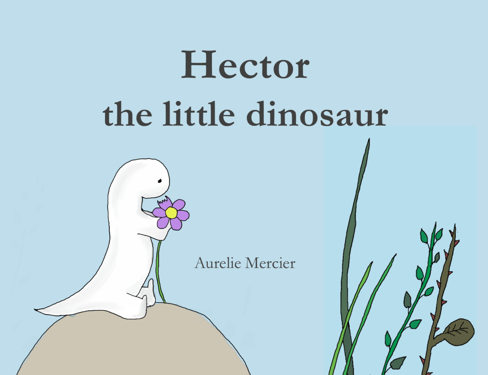

Aurélie lives in London with her partner and 4 year old son. She is French and speaks fluently English and Italian.

In France, she studied art and fashion design. She moved to Italy and started a career in Digital Marketing.
She wrote 2 books for Italian publishers (Francese da leggere, da ridere, da imparare and Instant Francese in collaboration with girls4teaching).

**Hector the little dinosaur** is her first children book.

_"I started sketching mini stories to find a fun way to teach my toddler some lessons but as he grew so fond of the stories I had to print a proper book"._
