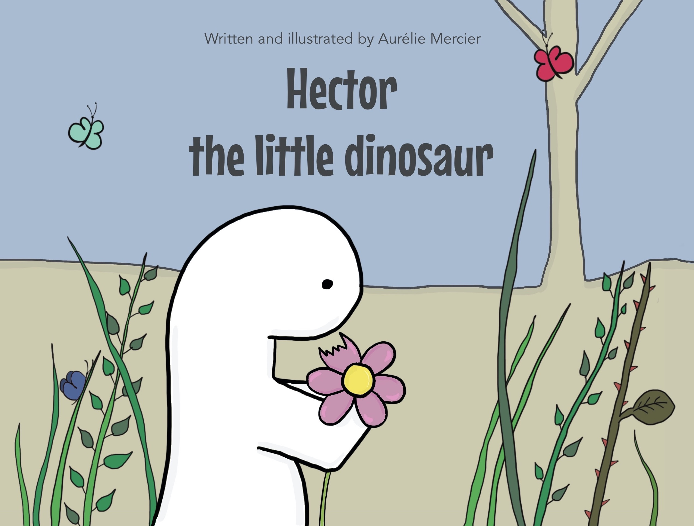

Aurélie is a digital marketer with an artistic background living in London.

She lived in Italy for a few years and wrote two books for Italian publishers ([Francese da leggere, da ridere, da imparare](https://www.amazon.co.uk/imparare-approfondimenti-migliorare-divertendosi-Girls4teaching/dp/8858017358/ref=sr_1_2?dchild=1&keywords=aurelie+mercier&qid=1592776721&sr=8-2) and [Instant Francese](https://www.amazon.co.uk/Instant-Francese-innovativo-pr%C3%AAt-%C3%A0-porter-Italian-ebook/dp/B07CRQW5X5/ref=sr_1_1?dchild=1&keywords=instant+francese&qid=1592776764&sr=8-1) in collaboration with girlsforteaching). She also started a [food blog](https://food.aureliemercier.com/) with the arrival of her son in 2015.

In 2020, she publishes **Hector the little dinosaur**, her first children book.

_"I started sketching mini stories to find a fun way to teach my toddler some lessons but it quickly became a much bigger and exciting project"._
