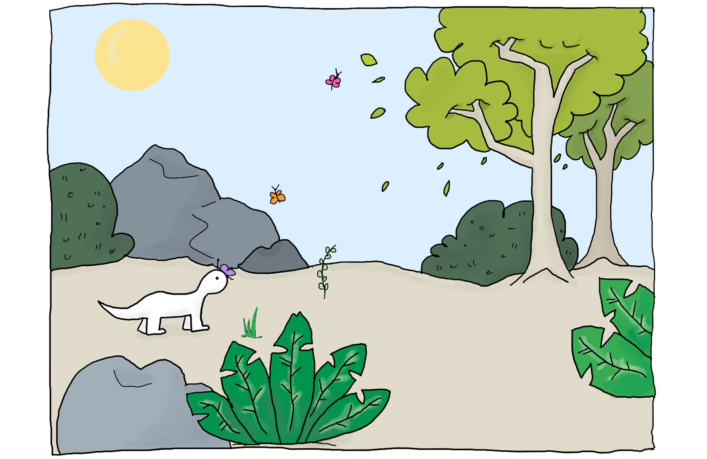
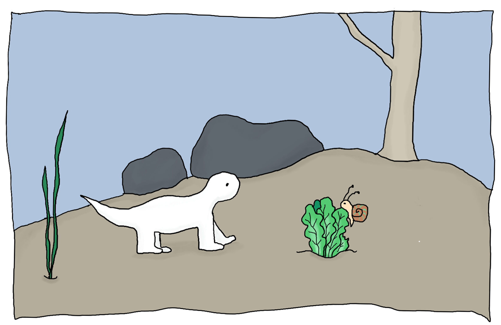

[Italian Version 🍕](/it/hector)

---

Hector is a little dinosaur  
who lives in the forest.  
He spends all his days eating flowers  
and having a rest.

---

But you see, poor Hector  
is very, very slow.  
Flowers are not so tasty,  
but what else could he eat?

---

One day, he finds a carrot.  
Looking around him he wonders:  
“Is there anyone who might steal my food?” 
Hopefully no one.

---

“Hi Bunny. How are you?” 
“Hi Hector, not eating flowers today?” 
“I was just about to try this carrot”, replies Hector.  
“Interesting”, the bunny says, thinking for a minute...

---

“Hey! You’re eating my carrot!” cries Hector.  
“Sorry, you’re too slow.  
Didn't you know?  
Carrots are my favourite food.”

---

Later, on top of a rock, he’s searching:  
“What else could I eat?” 
Something sweet and juicy, he’s thinking.  
But can you see it?

---

Oh look, an apple!  
That must be good.  
Can you see anyone  
who might steal his food?

---

“Hi Bear. How are you?” asks Hector.  
“I’m hungry”, says Bear.  
“Me too!” replies Hector.  
“Let’s see who can get this apple first then”, says Bear.

---

“I thought a bear’s favourite food was honey?…” 
But Bear is already eating the apple.  
Hector has been too slow again.

---

He walks some more and... oh look, a salad!  
That must be good.  
Hopefully no one will steal his food.  
Who else might want this salad?

---

“Oh, hi Snail. How are you?” 
“I’m very hungry”, says Snail slowly.  
“I see”, replies Hector, “shall we share then?” 
“Sure, but you better hurry!”

---

Hector wants to run.  
But he’s very, very slow.  
Just a few more steps.  
But the snail is getting closer.

---

Hector moves another foot.  
But the snail is much faster.

---

“Don’t finish it: we can still be friends!” 
tries Hector one more time,  
desperately...

---

Once again, Hector was too slow.  
There’s nothing left,  
the salad is gone,  
and there’s no more food around.

---

When a little mouse  
comes to offer him a nut.  
“I’m small and fast, I can give you this and more.  
You’re big and strong, you can be my protector.”

---

Hector is not alone anymore,  
he is so happy!  
Hopefully no one will steal his new friend.  
Can you see anybody?

---

Oh no, a fox! “This mouse looks yummy.  
Do you mind if we share it?” asks Fox.  
“Well”, answers Hector, “if you want it  
You’ll have to do something for me.

---

Mice are my favourite food,  
but I think those nuts taste much better.  
Go! I hold the mouse, you try the nut.  
Right behind you, tell me, is it tasty?”

---

“Did you just play a trick on me?” grumbles Fox.  
“Where is the mouse, I want to know!” 
“I’m sorry”, Hector answers the Fox,  
“I ate it all, you’re far too slow!”

---

That was the beginning of a beautiful friendship.

[Back to top](#)
