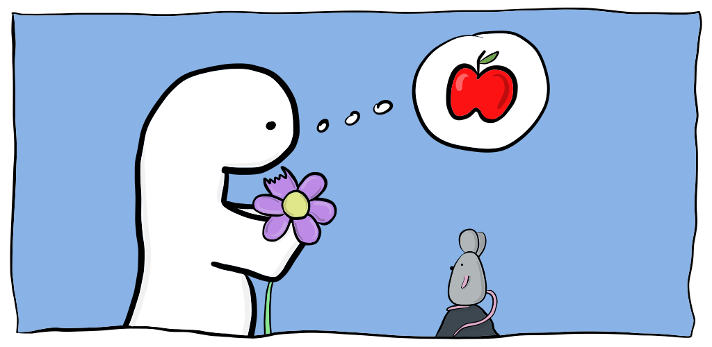

# Hector the little dinosaur

## About the story

Hector is a cute little dinosaur who has a small peculiarity:
he’s very, very slow.

Poor Hector has never eaten anything else than flowers, but one day, he decides to try something new…

## About the book

Written and illustrated by Aurelie Mercier

**Paperback:** 45 pages  
**Language:** English  
**Dimension:** 21 x 0.3 x 16 cm

## About the app

Download Hector the little dinosaur on Google Play Store and listen to Liam (4 years old) reading out loud the story.
