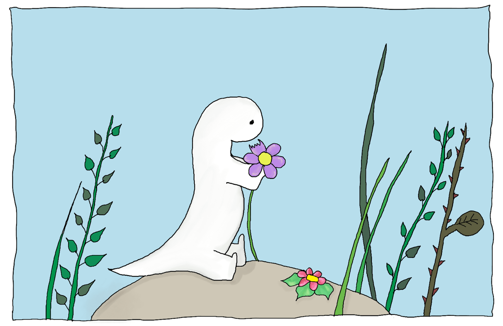
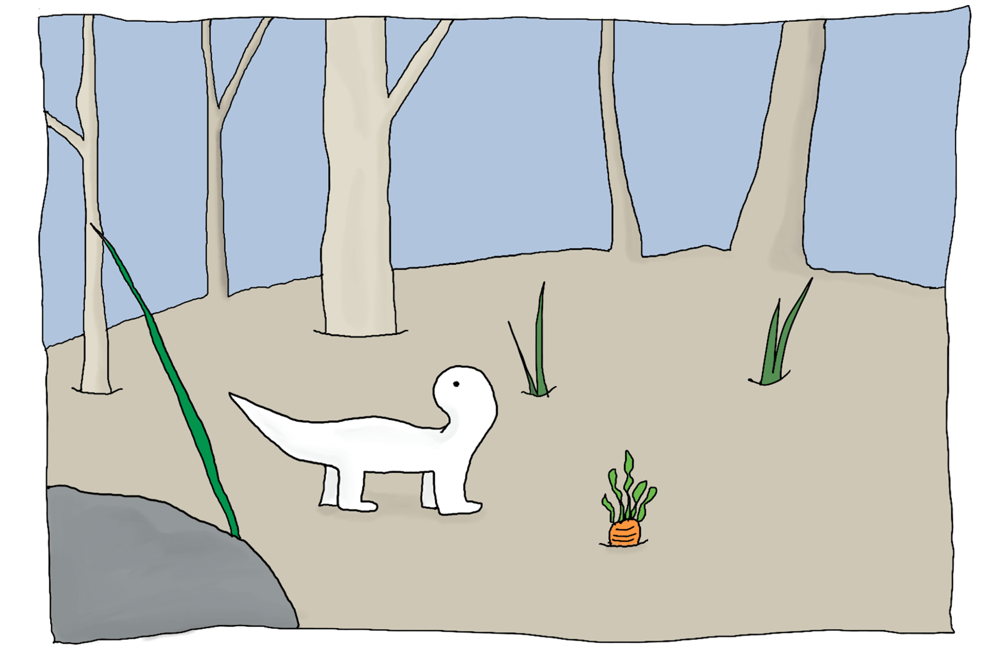
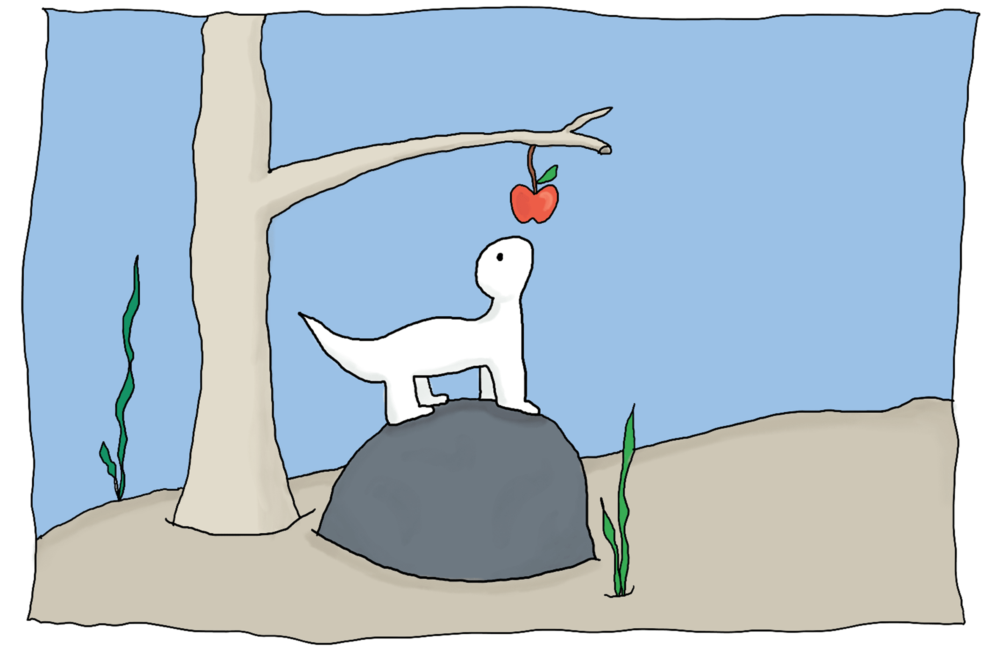
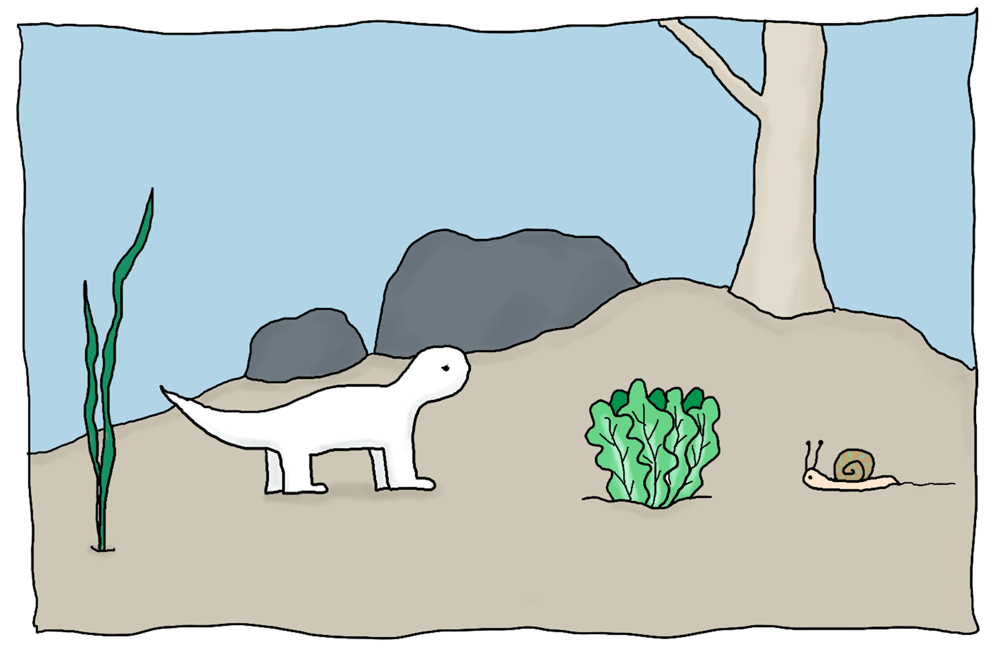
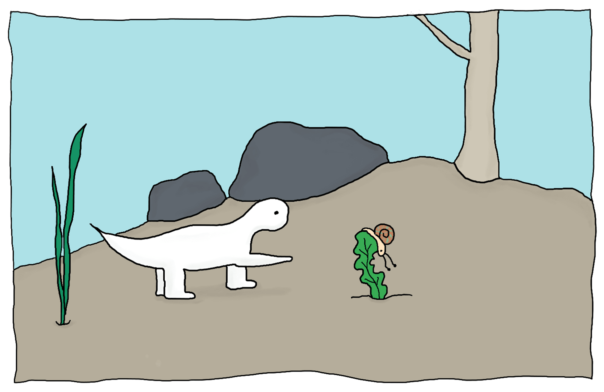

---

Hector is a little dinosaur  
Who lives in the forest.  
He spends all his days eating flowers  
And rest.

---

But you see, poor Hector  
Is very very slow.  
Flowers are not so tasty  
But what else could he eat?

---

One day, he finds a carrot.  
Looking around, him he wonders:  
“Is there anyone who might steal my food?"  
Hopefully no-one.

---

“Hi Bunny. How are you?"  
“Hi Hector, not eating flowers today?"  
“I was just about to try this carrot", replies Hector.  
“Interesting", the bunny thinks for a minute...

---

“You’re eating my carrot!" cries Hector.  
“Sorry, you’re too slow.  
And everyone knows that carrots  
Are my favourite food."

---

Later, on top of a rock, he’s searching  
“What else could I eat?"  
Something sweet and juicy, he’s thinking.  
But can you see anything?

---

Oh look, an apple!  
That must be good.  
Can you see anyone  
Who might steal his food?

---

“Hi Bear. How are you?" asks Hector.  
“I’m hungry", said the Bear.  
“Me too!" replies Hector.  
“Let’s see who can get this apple first then", says Bear.

---

“I thought bears’ favourite food was honey?…"  
But Bear is already eating the apple  
Hector has been too slow again.

---

He walks some more and... oh look, a salad!  
That must be good.  
Hopefully no-one will steal his food.  
Who else might want this salad?

---

“Oh, hi Snail. How are you?"  
“I’m very hungry", says Snail slowly.  
“I see", replies Hector, “shall we share then?"  
“Sure, but you better hurry!"

---

Hector wants to run.  
But he’s never been too good at running.  
Just a few more steps.  
But the snail is getting closer.

---

Hector moves another paw.  
But the snail is much faster.

---

“Don’t finish it: we can still be friends!"  
Tries Hector one more time  
Desperately...

---

Once again, Hector was too slow  
There’s nothing left  
The salad is gone  
And there’s no more food around him.

---

When a little mouse  
Comes to offer him a nut.  
“I’m small and fast, I can give you more.  
You’re big and strong, you can protect me."

---

Hector is not alone anymore  
He is so happy!  
Hopefully no-one will steal his new friend  
Can you see anybody?

---

Oh no, a fox! “This mouse looks yummy  
Do you mind to share with me?" asks the fox.  
“Well", answers Hector, "if you want it"  
You’ll have to do something for me.

---

"Mice are my favourite food  
But I think those nuts taste much better"  
"Go! I hold the mouse, you try the nut  
Right behind you, tell me, is it tasty?"

---

“Did you just play a trick on me?" says Fox.  
“Where is the mouse, I want to know!"  
“I’m sorry", Hector answers the Fox  
“I ate it all, you’re too slow!"

---
