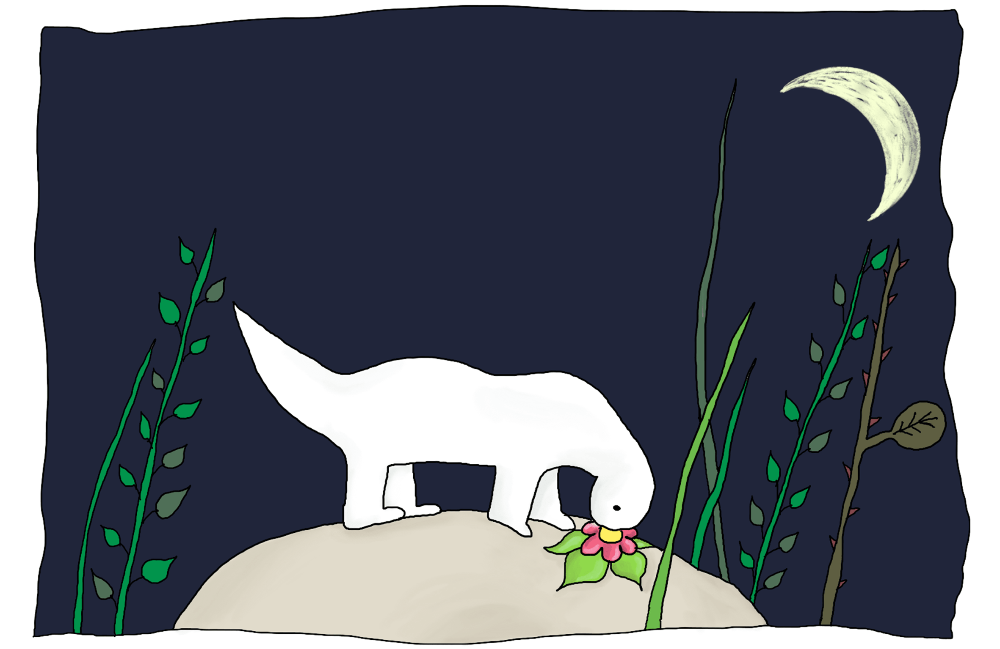
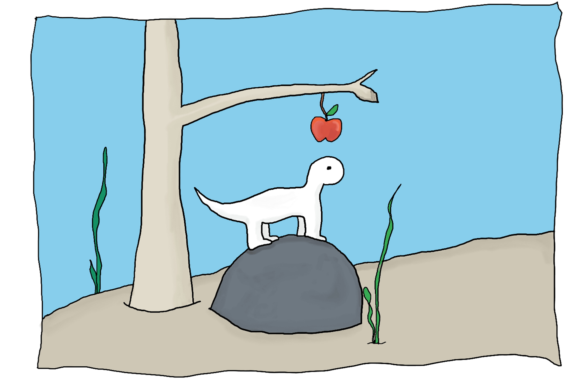
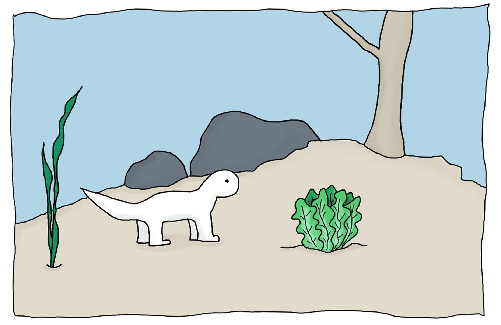
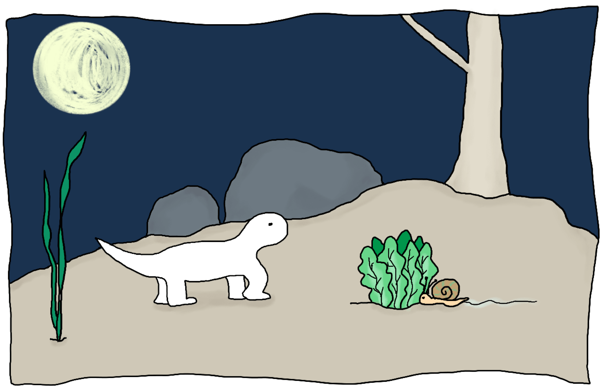
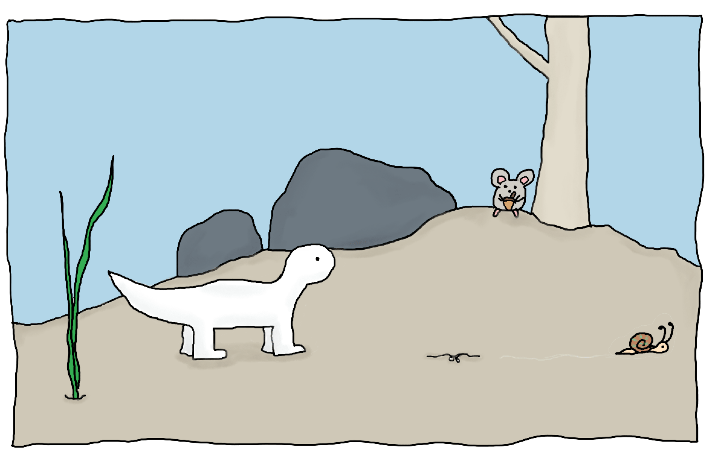
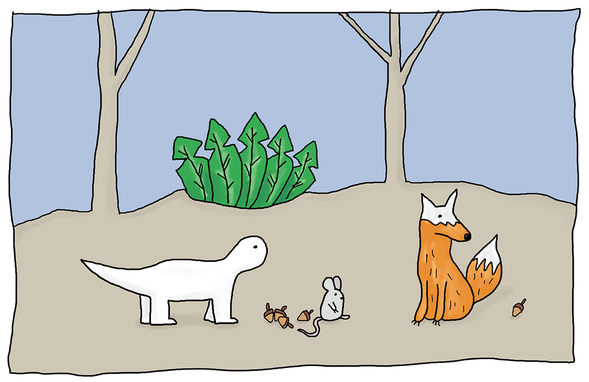

Hector è un piccolo dinosauro  
Che vive nella foresta.  
Passa tutte le sue giornate a mangiare fiori  
E riposare.

---

Ma lo sai? Povero Hector  
È moooolto mooolto lento.  
I fiori non sono molto saporiti  
Ma cosa altro potrebbe mangiare?

---

Un giorno trova una carota.  
Si guarda in giro e pensa:  
“Chissà se qualcuno vorrà rubarmela?”  
Speriamo di no!

---

“Hey Coniglietto, come stai?”  
“Ciao Hector, niente fiori per te quest’oggi?”  
“Stavo per mangiare questa carota” risponde Hector  
“Interessante!” E senza pensarci nemmeno un minuto...

---

“Stai mangiando la mia carota!” piagnucola Hector  
“Mi spiace, sei troppo lento.  
E tutti sanno che le carote  
sono il mio cibo preferito!” dice Coniglio.

---

Poco dopo in cima a una roccia si guarda intorno  
“Cos’altro potrei mangiare?”  
Qualcosa di dolce e succoso, mmm.  
Vedi qualcosa?

---

Oh guarda, una mela!  
Sarà sicuramente buonissima!  
Pensi che qualcuno gli ruberà  
il cibo questa volta?

---

“Ciao Orso, come va?” Chiede Hector.  
“Sono affamato!” dice Orso.  
“Anche io!” risponde Hector.  
“Vediamo chi si mangia questa mela per primo allora” dice Orso.

---

“Pensavo che agli orsi piacesse il miele no?”  
Ma Orso sta già mangiando la mela.  
Hector è stato troppo lento anche questa volta.

---

Cammina un po’ e oh ecco un’insalata!  
Sarà sicuramente buonissima!  
Pensi che qualcuno gli ruberà  
il cibo questa volta?

---

“Hey ciao Lumaca, come stai?”  
“Sono super affamata” dice lentamente Lumaca.  
“Ah davvero?” risponde Hector “Facciamo un po’ per uno?”  
“Ok ma fai in fretta!”

---

Hector vorrebbe correre.  
Ma non è mai stato molto bravo nella corsa.  
Ancora qualche passo…  
Ma Lumaca si sta avvicinando.

---

Hector muove un’altra zampa.  
Ma la lumaca è più veloce.

---

“Non finirla! Possiamo essere amici!”  
Prova Hector in un ultimo tentativo  
Disperato…

---

Ancora una volta Hector è stato troppo lento  
Non è rimasto più niente  
L’insalata non c’è più  
E con lei tutto il cibo è sparito.

---

A quel punto spunta un topolino  
che offre una nocciolina a Hector.  
“Sono piccino e veloce e posso dartene ancora,  
tu sei grande e forte, vuoi essere mio amico?”

---

Hector non è più solo  
non è mai stato così felice  
Speriamo che nessuno rovini questo momento.  
Vedi qualcuno?

---

Oh no, una volpe!  
“Questo topolino sembra proprio buono  
me lo daresti per un po’?” Chiede Volpe.  
“Se lo vuoi allora dovrai fare qualcosa per me”  
risponde Hector

---

“I topolini sono il mio cibo preferito  
Ma penso che quelle noccioline siano anche meglio.  
Vai! Io tengo il topolino e tu provi una nocciola.  
Lì dietro di te, dimmi è buona?”

---

“Mi hai imbrogliato?” dice Volpe.  
“Dov’è finito il mio topo?”  
“Ops…” risponde Hector,  
“L’ho mangiato tutto, sei stata troppo lenta!”

---
