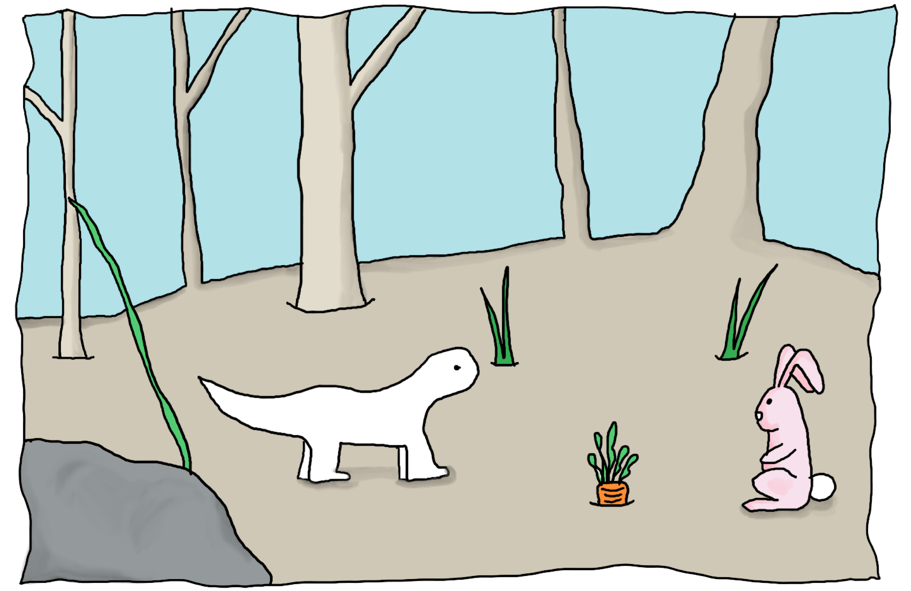
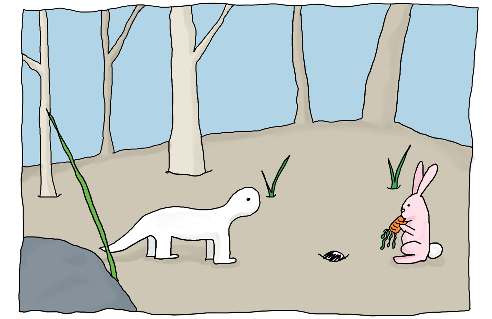
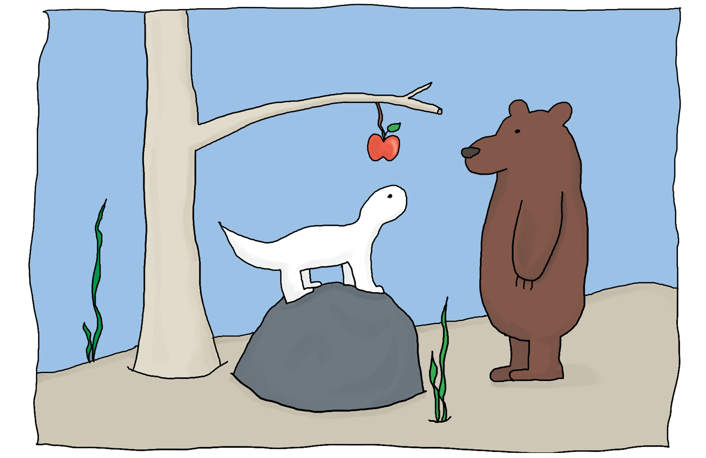
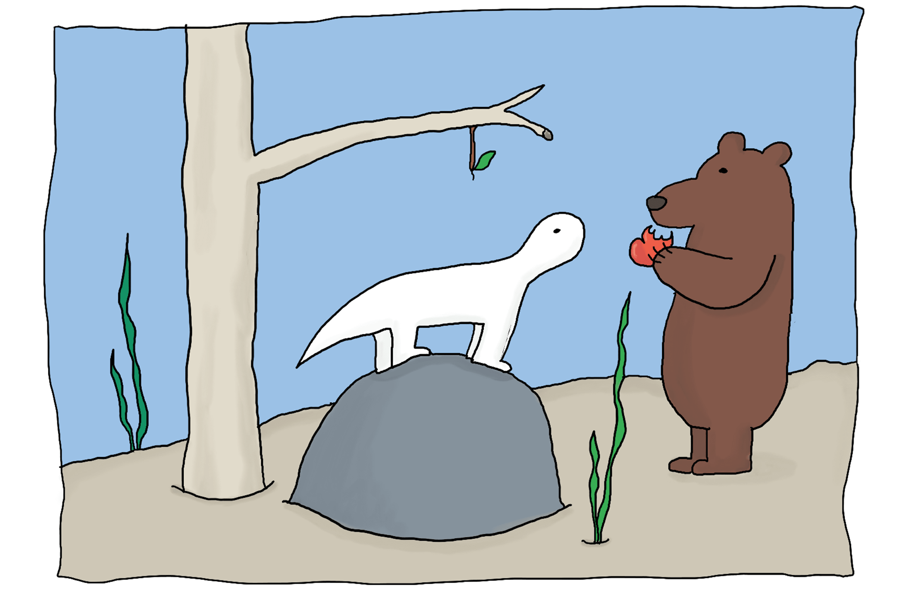
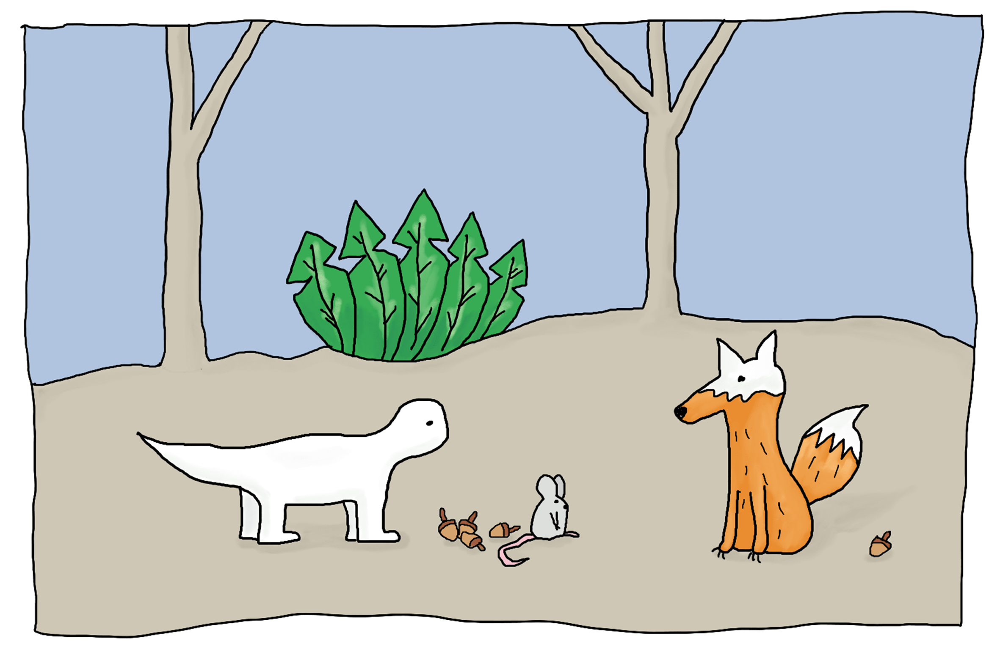

---

Hector è un piccolo dinosauro  
che vive nella foresta.  
Passa tutte le sue giornate a mangiare fiori  
e a riposare.

Devi sapere che Hector  
è moooolto mooolto lento!  
I fiori non sono molto saporiti.  
Cos'altro potrebbe mangiare?

Un giorno Hector trova una carota.  
Si guarda intorno e pensa:  
"Non ci sarà qualcuno che vorrà rubarmela?"  
Speriamo di no!

"Hey Coniglietto, come stai?"  
"Ciao Hector, niente fiori per te quest'oggi?"  
"Stavo giusto per mangiare questa carota" risponde Hector  
"Interessante!" E senza pensarci nemmeno un minuto...

"Stai mangiando la mia carota!" piagnucola Hector  
"Mi dispiace, sei troppo lento.  
E poi lo sanno tutti che le carote  
sono il mio cibo preferito!" dice Coniglio.

Poco più tardi, in cima a una roccia, Hector si guarda intorno.  
"Cos'altro potrei mangiare?"  
Qualcosa di dolce e succoso, mmm.  
Riesci a vedere qualcosa?

Oh guarda, una mela!  
Sarà sicuramente buonissima!  
Pensi che qualcuno gli ruberà  
il cibo anche questa volta?

"Ciao Orso, come va?" Chiede Hector.  
"Sono affamato!" dice Orso.  
"Anche io!" risponde Hector.  
"Vediamo chi si mangia questa mela per primo allora" dice Orso.

"Pensavo che agli orsi piacesse il miele, no?"  
Ma Orso sta già mangiando la mela.  
Hector è stato troppo lento anche questa volta.

Cammina cammina e oh, ecco un'insalata!  
Sarà sicuramente buonissima!  
Pensi che qualcuno gli ruberà  
il cibo anche questa volta?

"Hey, ciao Lumaca, come stai?"  
"Sono super affamata" dice lei lentamente.  
"Ah davvero?" risponde Hector "Facciamo un po' per uno?"  
"Ok ma fai in fretta!"

Hector vorrebbe correre.  
Ma non è mai stato molto bravo nella corsa.  
Ancora qualche passo…  
Ma Lumaca si sta avvicinando.

Hector muove un'altra zampa,  
Ma la lumaca è più veloce.

"Non finirla! Possiamo essere amici!"  
Prova Hector in un ultimo tentativo  
Disperato…

Ancora una volta è stato troppo lento  
Non è rimasto più niente,  
L'insalata non c'è più  
E con lei tutto il cibo è sparito.

A quel punto spunta un topolino  
che offre una nocciolina a Hector.  
"Posso dartene ancora se vuoi. Ti va di essere mio amico?  
Io sono piccino e veloce e tu grande e forte!"

Hector non è più solo,  
non è mai stato così felice.  
Speriamo che nessuno rovini questo momento.  
Vedi qualcuno?

Oh no, una volpe!  
"Questo topolino sembra proprio buono  
che ne dici di darmelo?" Chiede Volpe.  
"Se lo vuoi, dovrai fare qualcosa per me"  
risponde Hector.

"I topolini sono il mio cibo preferito,  
Ma penso che quelle noccioline siano anche meglio.  
Vai! Io tengo il topolino e tu provi una nocciola.  
È lì dietro di te, dimmi, è buona?"

"Mi hai imbrogliato?" dice Volpe.  
"Dov'è finito il mio topo?"  
"Ops…" risponde Hector,  
"L'ho mangiato tutto, sei stata troppo lenta!"

---

E così iniziò di una meravigliosa amicizia

[Torna su](#)